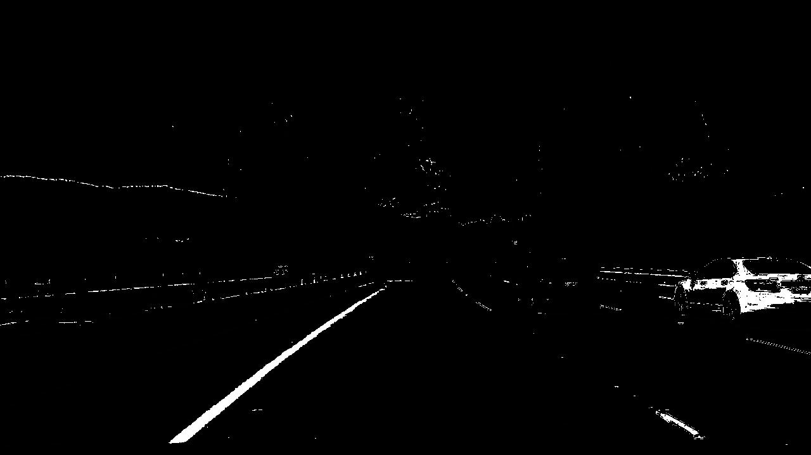
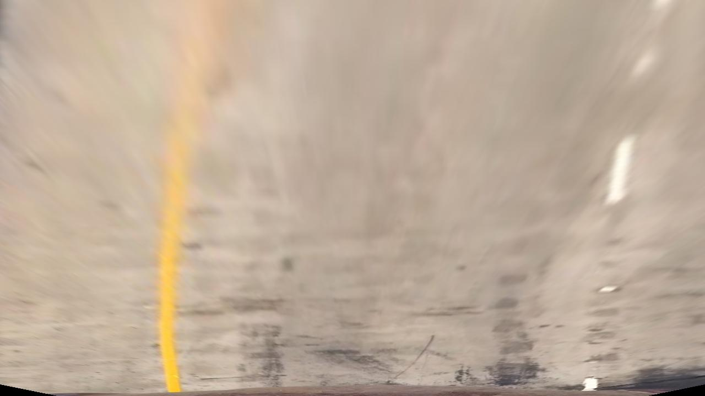
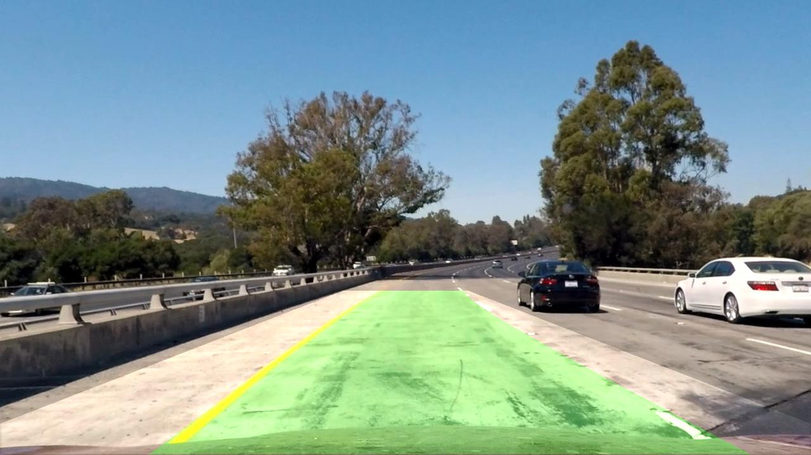

## Writeup Template

**Advanced Lane Finding Project**

The goals / steps of this project are the following:

* Compute the camera calibration matrix and distortion coefficients given a set of chessboard images.
* Apply a distortion correction to raw images.
* Use color transforms, gradients, etc., to create a thresholded binary image.
* Apply a perspective transform to rectify binary image ("birds-eye view").
* Detect lane pixels and fit to find the lane boundary.
* Determine the curvature of the lane and vehicle position with respect to center.
* Warp the detected lane boundaries back onto the original image.
* Output visual display of the lane boundaries and numerical estimation of lane curvature and vehicle position.

Pipeline:


For explation with images, here I take test1 image as example, raw Image:


### Camera Calibration

#### 1. Briefly state how you computed the camera matrix and distortion coefficients. Provide an example of a distortion corrected calibration image.

The code for this step is contained in `scipts/camera_calibration.py`).  

I start by preparing "object points" in calibrate function, which will be the (x, y, z) coordinates of the chessboard corners in the world. Here I am assuming the chessboard is fixed on the (x, y) plane at z=0, such that the object points are the same for each calibration image.  Thus, `objp` is just a replicated array of coordinates, and `objpoints` will be appended with a copy of it every time I successfully detect all chessboard corners in a test image.  `imgpoints` will be appended with the (x, y) pixel position of each of the corners in the image plane with each successful chessboard detection.  

I then used the output `objpoints` and `imgpoints` to compute the camera calibration and distortion coefficients using the `cv2.calibrateCamera()` function.  I applied this distortion correction to the test image using the `cv2.undistort()` function and obtained this result: 


### Pipeline (single images)

#### 1. Provide an example of a distortion-corrected image.

Undistortion after calibration: (left distorted, right undistorted)


#### 2. Describe how (and identify where in your code) you used color transforms, gradients or other methods to create a thresholded binary image.  Provide an example of a binary image result.

I used a combination of color and gradient thresholds to generate a binary image in function called `threshold`,which appears in `scripts/transform.py` is used.  Here's an example of my output for this step.  


#### 3. Describe how (and identify where in your code) you performed a perspective transform and provide an example of a transformed image.

The code for my perspective transform includes a function called `warp()`, which appears in the file `scripts/transform.py` (output_images/examples/example.py) (or, for example, in the 3rd code cell of the IPython notebook).  The `warper()` function takes as inputs an image (`img`), source (`src`) and destination (`dst`) points are automated inside the function as below.  I chose the hardcode the source and destination points in the following manner:

```python
	src = np.float32(
	[[(img_size[0] / 2) - 45, img_size[1] / 2 + 100],
	[((img_size[0] / 6) - 0), img_size[1]],
	[(img_size[0] * 5 / 6) + 60, img_size[1]],
	[(img_size[0] / 2 + 45), img_size[1] / 2 + 100]])
	
	dst = np.float32(
	[[(img_size[0] / 4), 0],
	[(img_size[0] / 4), img_size[1]],
	[(img_size[0] * 3 / 4), img_size[1]],
	[(img_size[0] * 3 / 4), 0]])
```

I verified that my perspective transform was working as expected by drawing the `src` and `dst` points onto a test image and its warped counterpart to verify that the lines appear parallel in the warped image.




#### 4. Describe how (and identify where in your code) you identified lane-line pixels and fit their positions with a polynomial?

This script is there in function called `detect_lanes` in `scripts/helper_funcs.py` uses function `find_window_centroids` which does sliding window approach with convolution as described in lecture and fit my lane lines with a 2nd order polynomial like this and filled green color between those lines:


#### 5. Describe how (and identify where in your code) you calculated the radius of curvature of the lane and the position of the vehicle with respect to center.

I did this in lines 99 through 111 in my code in function called `detect_lines` in`scipts/helper_funcs.py`
```python
		# Define conversions in x and y from pixels space to meters
		y_eval = np.max(ploty)
		ym_per_pix = 30/720 # meters per pixel in y dimension
		xm_per_pix = 3.7/700 # meters per pixel in x dimension

		# Fit new polynomials to x,y in world space
		left_fit_cr = np.polyfit(ploty*ym_per_pix, left_fitx*xm_per_pix, 2)
		right_fit_cr = np.polyfit(ploty*ym_per_pix, right_fitx*xm_per_pix, 2)
		# Calculate the new radii of curvature
		left_curverad = ((1 + (2*left_fit_cr[0]*y_eval*ym_per_pix + left_fit_cr[1])**2)**1.5) / np.absolute(2*left_fit_cr[0])
		right_curverad = ((1 + (2*right_fit_cr[0]*y_eval*ym_per_pix + right_fit_cr[1])**2)**1.5) / np.absolute(2*right_fit_cr[0])
		# Now our radius of curvature is in meters
		print(left_curverad, 'm', right_curverad, 'm')

```
and offset is calculated as:
```
offset=(leftx[-1]+rightx[-1])/2-640
offset=offset*xm_per_pix
```
These are printed on the video, please check the saved video at:
https://github.com/srikanthmalla/Advanced_Lane_Line_Tracking/blob/master/output_videos/project_video.mp4

#### 6. Provide an example image of your result plotted back down onto the road such that the lane area is identified clearly.

I implemented this step in function called `unwarp()` in `scrips/transform.py`.  Then it is added to original image in `scripts/process.py` in function `process_image` at line 57. Here is an example of my result on a test image:




### Pipeline (video)

#### 1. Provide a link to your final video output.  Your pipeline should perform reasonably well on the entire project video (wobbly lines are ok but no catastrophic failures that would cause the car to drive off the road!).
`scripts/process.py` has function called `process_video()` to process the video using the same function used for images
Here is the video link:

<a href="http://www.youtube.com/watch?feature=player_embedded&v=9tOoQaFnX4E
" target="_blank"></a>
---

### Discussion

#### 1. Briefly discuss any problems / issues you faced in your implementation of this project.  Where will your pipeline likely fail?  What could you do to make it more robust?
If warping is bad, this could happen at turns causing the left is lane not found (also caused when the noise making second line to predict and polynomial fit could go bad):


I overcame this, by good warping.

When Lighting is different the thresholding range needs to be different, but this might cause extra noise by increasing the thresholding range. For example, to overcome this problem shown in below image which has double line detected on left, to get single peak I adjusted window size while doing convolution and also adjusted the threshold range. Also, I changed gradient calculation from sobel to laplacian for better output.


May be deep learning approach (data driven) could adapt to these changes instead of hand tuning parameters.
